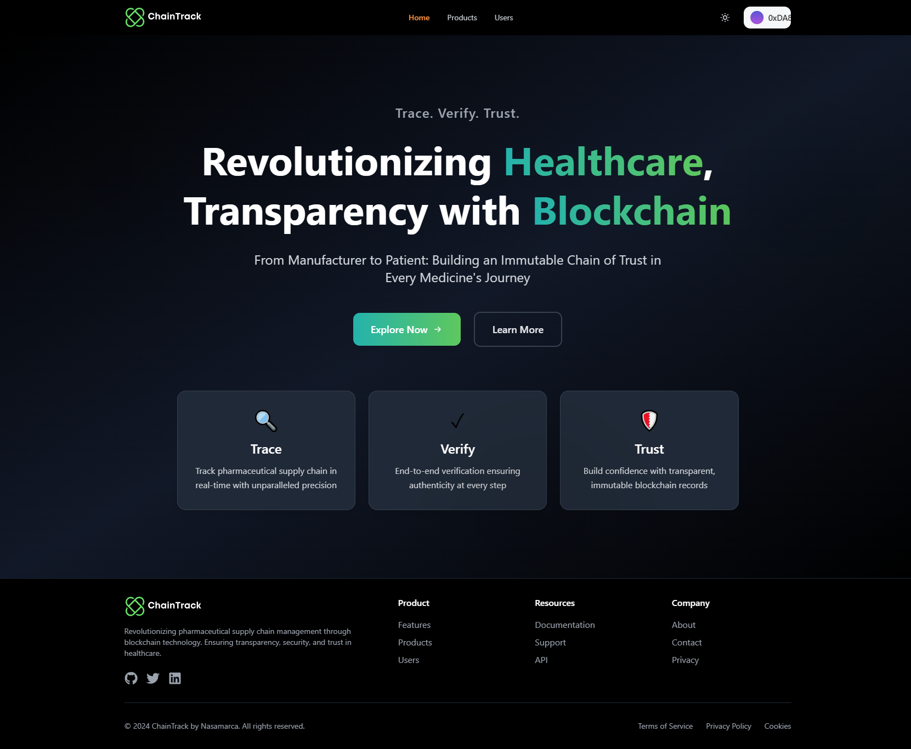
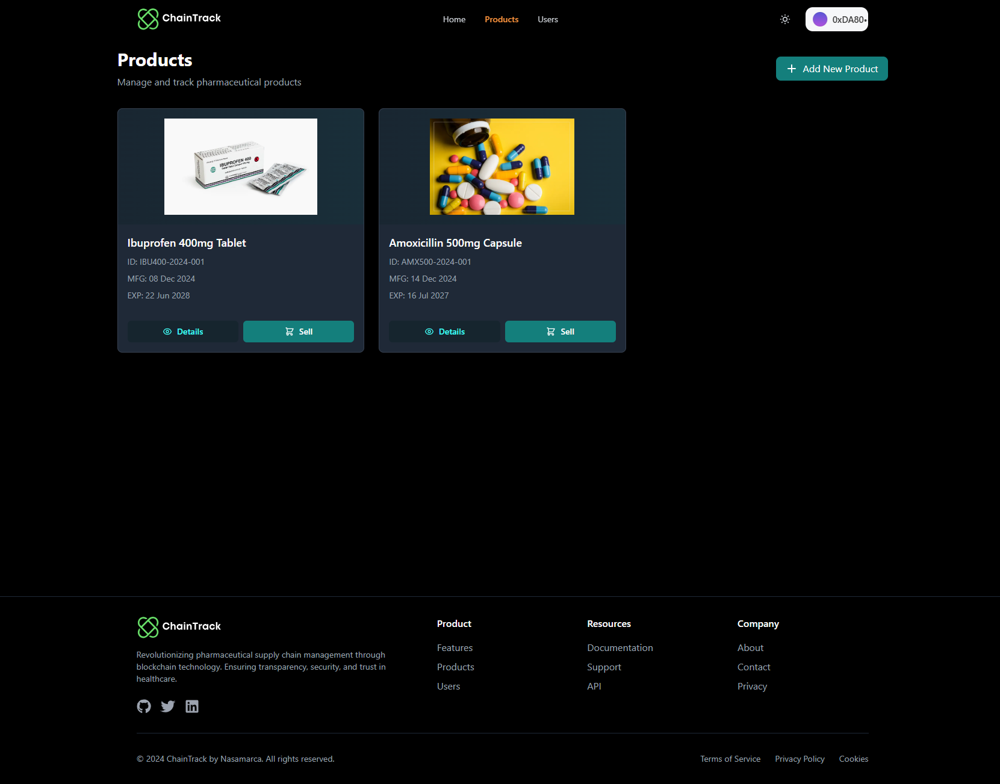
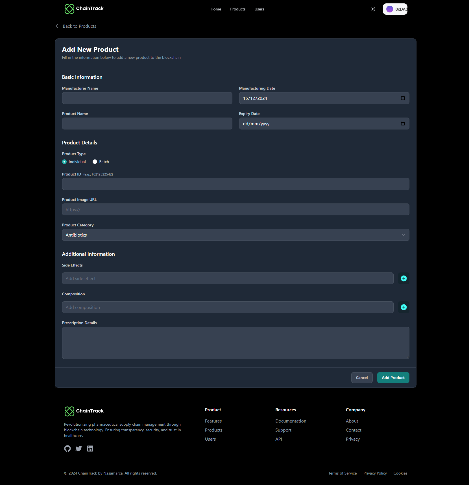
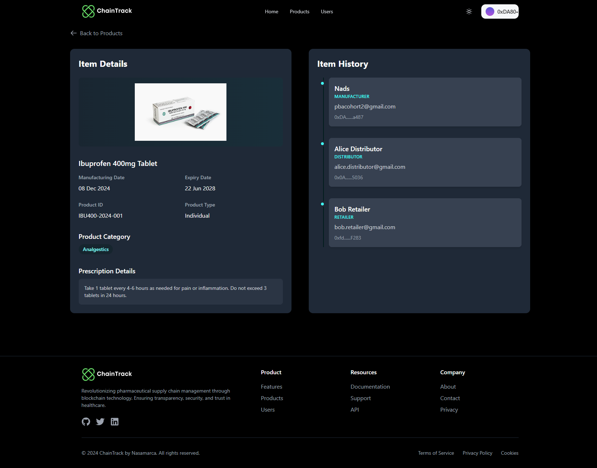
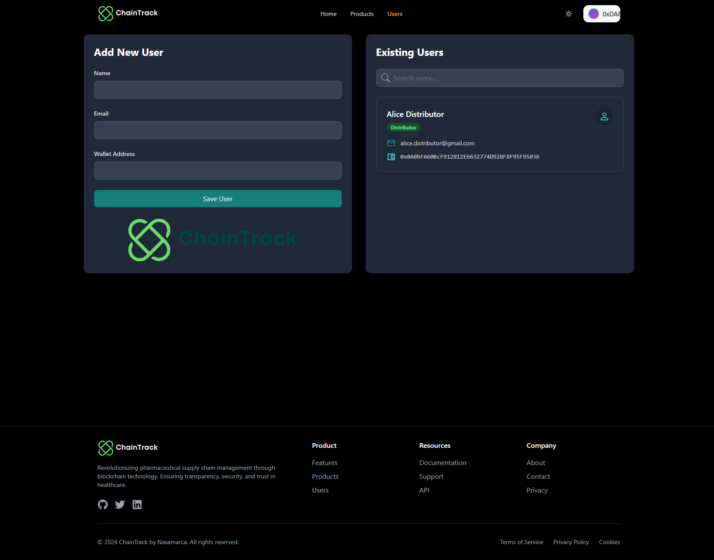

# ⛓ ChainTrack

**Revolutionizing Healthcare Transparency with Blockchain**  
*From Manufacturer to Patient: Building an Immutable Chain of Trust in Every Medicine's Journey*

**Tagline: Trace. Verify. Trust.**

*Live Website* : [ChainTrack](chain-track-dapps.vercel.app)

## 📸 Application Screenshots

<div style="display: flex; flex-wrap: wrap; gap: 20px; justify-content: center;">

### Home
 

### Products Tracking Interface

</div>

<div style="display: flex; flex-wrap: wrap; gap: 20px; justify-content: center;">

### Supply Chain Visualization


### Product Details

</div>

<div style="display: flex; flex-wrap: wrap; gap: 20px; justify-content: center;">

### Users Management

</div>

## 🎥 Video Demonstration 
[ChainTrack - Demo](https://drive.google.com/drive/folders/1jrKX_E1lOiX5Esppfk4rXCSUVv9c0D3b?usp=sharing)

## 📋 Overview

ChainTrack is a blockchain-powered platform revolutionizing pharmaceutical supply chain transparency by creating an immutable record of every medicine's journey from manufacturer to patient. Built on secure smart contract technology, ChainTrack ensures authenticity, prevents counterfeiting, and establishes an unbreakable chain of custody for pharmaceutical products.

### Key Features:

- **End-to-End Traceability**: Every medication is tracked through its complete lifecycle across manufacturers, distributors, retailers, and patients, with real-time updates and timestamps at each transfer point.

- **Role-Based Authentication**: Secure role management system for all supply chain participants:
  - Manufacturers can register and track new pharmaceutical products
  - Distributors can verify and record medication transfers
  - Retailers can authenticate received products
  - Patients can verify their medication's complete journey

- **Immutable Record Keeping**: Every transaction, transfer, and ownership change is permanently recorded on the blockchain, creating an auditable history that cannot be altered.

- **Batch Management**: Support for both individual and batch tracking of pharmaceutical products, ensuring efficient inventory management while maintaining traceability.

- **Product Details Tracking**: Comprehensive product information including:
  - Manufacturing and expiration dates
  - Batch numbers and counts
  - Usage instructions
  - Product images
  - Additional safety information

### Benefits:

- **For Healthcare Providers**: Instant verification of medication authenticity and handling history.
- **For Manufacturers**: Protect brand integrity and prevent counterfeit products.
- **For Distributors**: Streamlined inventory management with real-time tracking.
- **For Retailers**: Ensure product authenticity and proper handling.
- **For Patients**: Complete confidence in medication authenticity and handling.

### 🔗 Smart Contract Details
- **Network**: Sepolia Testnet
- **Contract Address**: `0xdC9e17DDC37697554f23dd92932C4B6267678BF9` 
- **Block Explorer**: [View on Sepolia Etherscan](https://sepolia.etherscan.io/address/0xdC9e17DDC37697554f23dd92932C4B6267678BF9)

## 🛠️ Technology Stack

### Blockchain Infrastructure
- Ethereum Blockchain (Sepolia Testnet)
- Smart Contracts written in Solidity v0.8.9
- Foundry Development Framework
- Gas-optimized contract deployment

### Frontend Development
- Next.js 13.1.2
- React 18.2.0
- Tailwind CSS for styling
- Responsive design

### Web3 Integration
- ethers.js v5.7.2
- wagmi v0.9.6
- connectkit v1.1.1
- MetaMask wallet integration

### UI/UX Components
- Mantine hooks
- React Hook Form
- React Hot Toast
- React Icons
- React Modal
- Sharp for image optimization

### Development & Testing
- ESLint
- PostCSS
- Autoprefixer
- Foundry testing suite

## ⚙️ Prerequisites

Before you begin, ensure you have installed:
- Foundry (forge, cast, anvil)
- Node.js (v16 or later)
- npm or yarn
- MetaMask browser extension
- Git

## 🚀 Quick Start

### Smart Contract Development

1. **Clone the repository**
```bash
git clone https://github.com/marvelm67/Chain-Track
cd Chain-Track
```

2. **Install Foundry dependencies**
```bash
forge install
```

3. **Configure environment**
```bash
cp .env.example .env
```
Edit `.env` file with your:
- SEPOLIA_RPC_URL=https://sepolia.infura.io/v3/your-project-id
- PRIVATE_KEY=your_private_key
- ETHERSCAN_API_KEY=your_etherscan_api_key

4. **Build contracts**
```bash
forge build
```

5. **Run tests**
```bash
forge test
```

6. **Deploy to Sepolia**
```bash
forge script script/Deploy.s.sol:DeployScript --rpc-url $SEPOLIA_RPC_URL --private-key $PRIVATE_KEY --broadcast --verify
```

### Frontend Development

1. **Navigate to frontend directory**
```bash
cd frontend
```

2. **Install dependencies**
```bash
npm install
```

3. **Configure environment**
```bash
cp .env.example .env.local
```
Edit `.env.local` with your:
- NEXT_PUBLIC_CONTRACT_ADDRESS
- NEXT_PUBLIC_RPC_URL

4. **Run development server**
```bash
npm run dev
```

Visit `http://localhost:3000` to see your application.

## 📝 Smart Contract Development

### Project Structure
```
chain-track-dapps/
├── src/               # Smart contract source files
├── script/           # Deployment scripts
├── test/            # Test files
├── foundry.toml     # Foundry configuration
└── .env             # Environment variables
```

### Available Commands

- `forge build` - Compile contracts
- `forge test` - Run tests
- `forge test -vvv` - Run tests with detailed traces
- `anvil` - Start local Ethereum node
- `forge script script/Deploy.s.sol:DeployScript` - Deploy contracts
- `forge verify-contract --chain sepolia CONTRACT_ADDRESS ContractName` - Verify contract on Etherscan
- `forge script script/Deploy.s.sol:DeployScript --rpc-url $SEPOLIA_RPC_URL --private-key $PRIVATE_KEY --broadcast --verify` - Deploy and Verify

## 🎨 Frontend Development

### Project Structure
```
frontend/
├── components/       # React components
├── pages/           # Next.js pages
├── styles/          # CSS styles
├── utils/           # Utility functions
├── contexts/        # React contexts
└── public/          # Static assets
```

### Available Commands

- `npm run dev` - Start development server
- `npm run build` - Build for production
- `npm start` - Start production server
- `npm run lint` - Run linter

## 🔒 Security

- Smart contract security best practices implemented
- Regular security audits and updates
- Foundry's built-in security tools utilized
- Role-based access control
- Immutable transaction records

## 🤝 Contributing

1. Fork the repository
2. Create your feature branch (`git checkout -b feature/amazing-feature`)
3. Commit your changes (`git commit -m 'Add amazing feature'`)
4. Push to the branch (`git push origin feature/amazing-feature`)
5. Open a Pull Request

## 📄 License

This project is licensed under the MIT License - see the [LICENSE](LICENSE) file for details.

## 📞 Support

For support, email marvelmichael67@gmail.com

## 🙏 Acknowledgments

- OpenZeppelin for smart contract libraries
- Ethereum community
- Foundry team
- Next.js team
- Contributors and testers

---
Built with ❤️ for pharmaceutical supply chain integrity
# Chain-Track
# Chain-Track
